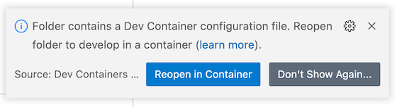

# Your fantastic repo

If you happen to use VSCode as your editor, you can open the repo in a [**Devcontainer**](https://code.visualstudio.com/docs/remote/containers). Devcontainers allow you to develop _inside_ a Docker container - which means all dependencies and packages are automatically set up for you. First, make sure you have the [Remote Development extension](https://marketplace.visualstudio.com/items?itemName=ms-vscode-remote.vscode-remote-extensionpack) installed.

Then, you can do two things.

1. Click the following button:

    

1. Or, open up the repo in VSCode. Then, you should see the following notification:

That's it 🙌🏻 Enjoy developing.